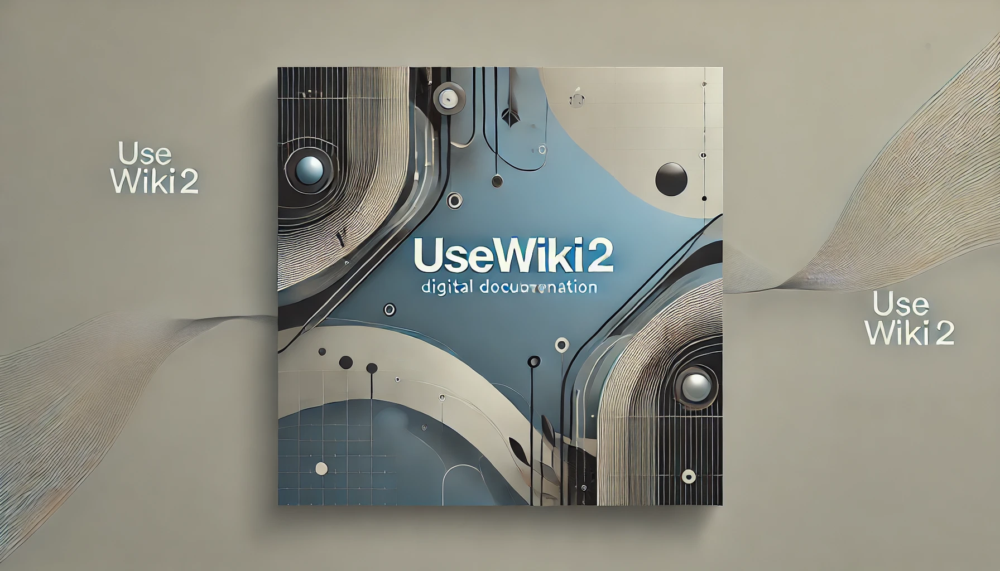
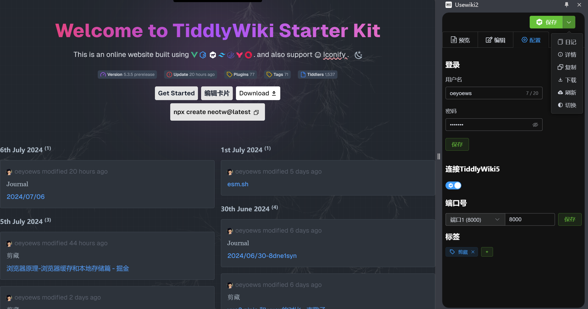

## Usewiki2

> [!IMPORTANT]
> 此插件目前支持 Google Chrome, Edge, 暂时不会进行兼容 firefox 的适配工作.

> [!IMPORTANT]
> 此插件目前没有上架商店， 如果从本地安装或者更新遇到问题, 建议删除插件后重新安装.

> [!TIP]
> ~~UseWiki2: usewiki 的 vue 版本，但是带来了更多功能。~~

> 将当前网页文章转换成 Markdown 文件，支持保存到TiddlyWiki5。 ~~支持 AI 整理润色~~。

<!-- * element plus, tailwindcss, wxt, vue, axios -->

## Install

* https://github.com/oeyoews/usewiki2/releases

<!-- ## TODO

* welcome page
* tour: https://element-plus.org/zh-CN/component/tour.html
* 右键菜单实现功能，快捷键提示
* 支持多条 journal 合并，支持配置默认日记 tag
* 支持删除刚刚保存的 tiddler. 主要不要删除修改过后的 title

## Roadmap

* i18n
* darkmode
* extension icon -->

## Credits

* icon: https://iconduck.com/icons/14145/markdown
* icons generator: https://alexleybourne.github.io/chrome-extension-icon-generator/

<!-- ## Doc

* https://developer.chrome.com/docs/extensions/develop/concepts/messaging?hl=zh-cn
* https://wxt.dev/guide/storage.html -->

<!-- * append to content
* options html(or new tab) -->

<!-- https://github.com/wxt-dev/wxt/issues/137 -->