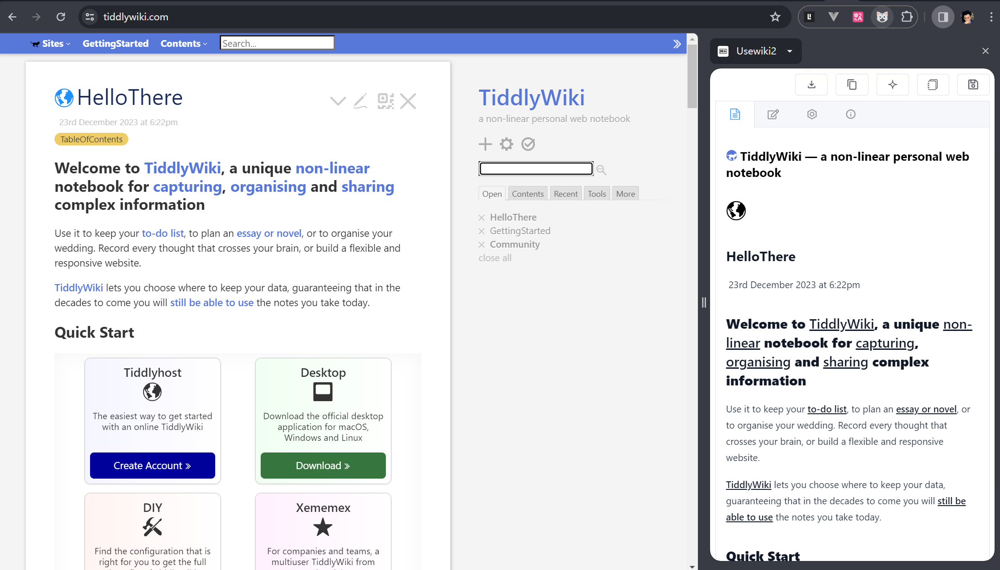

## Usewiki2

> [!TIP]
> UseWiki2: usewiki 的 vue 版本，但是带来了更多功能。

> 将当前网页文章转换成 Markdown 文件，支持保存到本地，TiddlyWiki5, GitHub(wip)

<!-- * element plus, tailwindcss, wxt, vue, axios -->

## Install

* https://github.com/oeyoews/usewiki2/releases

<!-- ## TODO

* welcome page
* tour: https://element-plus.org/zh-CN/component/tour.html
* port 通知优化
* 支持保存到 tiddlywiki
* 右键菜单实现功能，快捷键提示
* 日记模式 支持多条 journal 合并

## Roadmap

<<<<<<< HEAD
* ai prettier
=======
* 支持更改 prompt
>>>>>>> ai-groq
* 支持保存到 github, such as issues, discussion
* i18n
* codemirror6
* 代码拆分组件
* darkmode
* 统计大小
* extension icon -->

## Credits

* icon: https://iconduck.com/icons/14145/markdown
* icons generator: https://alexleybourne.github.io/chrome-extension-icon-generator/

<!-- ## Doc

* https://developer.chrome.com/docs/extensions/develop/concepts/messaging?hl=zh-cn
* https://wxt.dev/guide/storage.html -->